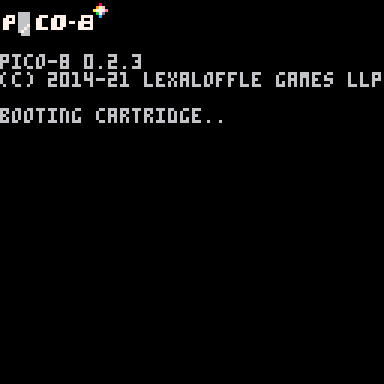

# Pico-8 Display

#### Python3 script to run a batch of Pico-8 carts on a regular interval

[load_carts.py](load_carts.py) launches Pico-8, and grabs a list of carts from a specific folder. This script defines the number of seconds a cart is displayed.

Each cart *must* pass the string parameters to and from the [runner.p8](runner.p8) cart as the string parameters contain the number of seconds to display a cart. Look at [example\_cart\_1.p8](to_display/example_cart_1.p8) or [example\_cart\_2.p8](to_display/example_cart_2.p8) for an example of how this is done
